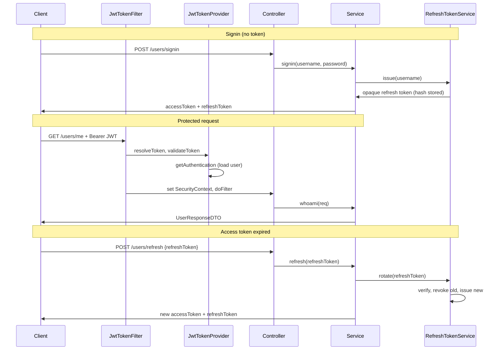

# Spring Boot JWT

[](https://github.com/murraco/spring-boot-jwt/actions/workflows/ci.yml)

A JWT authentication service built with Spring Boot and Spring Security, using short-lived access tokens paired with rotating, revocable refresh tokens.

## Stack


## Introduction (https://jwt.io)

Just to throw some background in, we have a wonderful introduction, courtesy of **jwt.io**! Let’s take a look:

### What is JSON Web Token?

JSON Web Token (JWT) is an open standard (RFC 7519) that defines a compact and self-contained way for securely transmitting information between parties as a JSON object. This information can be verified and trusted because it is digitally signed. JWTs can be signed using a secret (with the HMAC algorithm) or a public/private key pair using RSA.

Let's explain some concepts of this definition further.

**Compact**: Because of their smaller size, JWTs can be sent through a URL, POST parameter, or inside an HTTP header. Additionally, the smaller size means transmission is fast.

**Self-contained**: The payload contains all the required information about the user, avoiding the need to query the database more than once.

### When should you use JSON Web Tokens?

Here are some scenarios where JSON Web Tokens are useful:

**Authentication**: This is the most common scenario for using JWT. Once the user is logged in, each subsequent request will include the JWT, allowing the user to access routes, services, and resources that are permitted with that token. Single Sign On is a feature that widely uses JWT nowadays, because of its small overhead and its ability to be easily used across different domains.

**Information Exchange**: JSON Web Tokens are a good way of securely transmitting information between parties. Because JWTs can be signed—for example, using public/private key pairs—you can be sure the senders are who they say they are. Additionally, as the signature is calculated using the header and the payload, you can also verify that the content hasn't been tampered with.

### What is the JSON Web Token structure?

JSON Web Tokens consist of three parts separated by dots **(.)**, which are:

1. Header
2. Payload
3. Signature

Therefore, a JWT typically looks like the following.

`xxxxx`.`yyyyy`.`zzzzz`

Let's break down the different parts.

**Header**

The header typically consists of two parts: the type of the token, which is JWT, and the hashing algorithm being used, such as HMAC SHA256 or RSA.

For example:

```json
{
  "alg": "HS256",
  "typ": "JWT"
}
```

Then, this JSON is Base64Url encoded to form the first part of the JWT.

**Payload**

The second part of the token is the payload, which contains the claims. Claims are statements about an entity (typically, the user) and additional metadata. There are three types of claims: reserved, public, and private claims.

- **Reserved claims**: These are a set of predefined claims which are not mandatory but recommended, to provide a set of useful, interoperable claims. Some of them are: iss (issuer), exp (expiration time), sub (subject), aud (audience), and others.

> Notice that the claim names are only three characters long as JWT is meant to be compact.

- **Public claims**: These can be defined at will by those using JWTs. But to avoid collisions they should be defined in the IANA JSON Web Token Registry or be defined as a URI that contains a collision resistant namespace.

- **Private claims**: These are the custom claims created to share information between parties that agree on using them.

An example of payload could be:

```json
{
  "sub": "1234567890",
  "name": "John Doe",
  "admin": true
}
```

The payload is then Base64Url encoded to form the second part of the JSON Web Token.

**Signature**

To create the signature part you have to take the encoded header, the encoded payload, a secret, the algorithm specified in the header, and sign that.

For example if you want to use the HMAC SHA256 algorithm, the signature will be created in the following way:

```
HMACSHA256(
  base64UrlEncode(header) + "." +
  base64UrlEncode(payload),
  secret)
```

The signature is used to verify that the sender of the JWT is who it says it is and to ensure that the message wasn't changed along the way.
Putting all together

The output is three Base64 strings separated by dots that can be easily passed in HTML and HTTP environments, while being more compact when compared to XML-based standards such as SAML.

The following shows a JWT that has the previous header and payload encoded, and it is signed with a secret. Encoded JWT


### How do JSON Web Tokens work?

In authentication, when the user successfully logs in using their credentials, a JSON Web Token will be returned and must be saved locally (typically in local storage, but cookies can be also used), instead of the traditional approach of creating a session in the server and returning a cookie.

Whenever the user wants to access a protected route or resource, the user agent should send the JWT, typically in the Authorization header using the Bearer schema. The content of the header should look like the following:

`Authorization: Bearer <token>`

This is a stateless authentication mechanism as the user state is never saved in server memory. The server's protected routes will check for a valid JWT in the Authorization header, and if it's present, the user will be allowed to access protected resources. As JWTs are self-contained, all the necessary information is there, reducing the need to query the database multiple times.

This allows you to fully rely on data APIs that are stateless and even make requests to downstream services. It doesn't matter which domains are serving your APIs, so Cross-Origin Resource Sharing (CORS) won't be an issue as it doesn't use cookies.

The following diagram shows this process:

 

## JWT authentication summary

Token based authentication schema's became immensely popular in recent times, as they provide important benefits when compared to sessions/cookies:

- CORS
- No need for CSRF protection
- Better integration with mobile
- Reduced load on authorization server
- No need for distributed session store

Some trade-offs have to be made with this approach:

- More vulnerable to XSS attacks
- Access token can contain outdated authorization claims (e.g when some of the user privileges are revoked)
- Access tokens can grow in size in case of increased number of claims
- File download API can be tricky to implement
- True statelessness and revocation are mutually exclusive

That last trade-off is the one this project takes a position on: the access token is fully stateless and cannot be revoked, so it is kept short-lived, while the **refresh token is stateful and revocable**. Statelessness is preserved where it matters for throughput — ordinary API requests hit no database for authentication — and given up only on the comparatively rare refresh call. See [Refresh token design](#refresh-token-design).

**JWT Authentication flow is very simple**

1. User obtains Refresh and Access tokens by providing credentials to the Authorization server
2. User sends Access token with each request to access protected API resource
3. Access token is signed and contains user identity (e.g. user id) and authorization claims.

It's important to note that authorization claims will be included with the Access token. Why is this important? Well, let's say that authorization claims (e.g user privileges in the database) are changed during the life time of Access token. Those changes will not become effective until new Access token is issued. In most cases this is not big issue, because Access tokens are short-lived. Otherwise go with the opaque token pattern.

## File structure

```
spring-boot-jwt/
 │
 ├── src/main/java/
 │   └── murraco
 │       ├── configuration
 │       │   └── OpenApiConfig.java
 │       │
 │       ├── controller
 │       │   └── UserController.java
 │       │
 │       ├── dto
 │       │   ├── AuthResponseDTO.java
 │       │   ├── RefreshRequestDTO.java
 │       │   ├── UserDataDTO.java
 │       │   └── UserResponseDTO.java
 │       │
 │       ├── exception
 │       │   ├── CustomException.java
 │       │   └── GlobalExceptionHandlerController.java
 │       │
 │       ├── model
 │       │   ├── AppUserRole.java
 │       │   ├── AppUser.java
 │       │   └── RefreshToken.java
 │       │
 │       ├── repository
 │       │   ├── RefreshTokenRepository.java
 │       │   └── UserRepository.java
 │       │
 │       ├── security
 │       │   ├── JwtTokenFilter.java
 │       │   ├── JwtTokenProvider.java
 │       │   ├── MyUserDetails.java
 │       │   └── WebSecurityConfig.java
 │       │
 │       ├── service
 │       │   ├── RefreshTokenService.java
 │       │   └── UserService.java
 │       │
 │       └── JwtAuthServiceApp.java
 │
 ├── src/main/resources/
 │   ├── application.yml        # default profile (dev), JWT + refresh token placeholders
 │   └── application-dev.yml    # H2, JPA, server.port, H2 console (dev)
 │
 ├── src/test/java/murraco/controller/
 │   └── UserControllerTest.java
 │
 ├── .github/workflows/ci.yml
 ├── .gitignore
 ├── Dockerfile
 ├── LICENSE
 ├── mvnw, mvnw.cmd
 ├── README.md
 └── pom.xml
```

## Architecture overview

This is a REST API using the **access token + refresh token** pattern. Signin returns a pair:

- a short-lived **access token** — a stateless JWT sent as `Authorization: Bearer <token>` on every request;
- a long-lived **refresh token** — an opaque random string, stored server-side, used only to obtain a new access token.

The endpoints `/users/signin`, `/users/signup`, `/users/refresh` and `/users/logout` are public; all other endpoints require a valid access token. Roles `ROLE_ADMIN` and `ROLE_CLIENT` are enforced via `@PreAuthorize` on controller methods.



### JWT flow in this project

1. **Obtain tokens:** Send `POST /users/signin` with `username` and `password` (form or query params). The response is a JSON object with `accessToken`, `refreshToken`, `tokenType` and `expiresIn`.
2. **Call protected APIs:** Send the access token in the header: `Authorization: Bearer <accessToken>`.
3. **Filter chain:** `JwtTokenFilter` reads the header, validates the token via `JwtTokenProvider`, loads the user via `MyUserDetails`, and sets Spring’s `SecurityContext`.
4. **Authorization:** Controllers use `@PreAuthorize("hasRole('ROLE_ADMIN')")` (or similar) so only users with the right role can access the endpoint.
5. **Renew:** When the access token expires (401), send `POST /users/refresh` with the refresh token. No access token is required — that endpoint is deliberately outside the JWT filter, since the whole point is that it works once the access token is dead.
6. **Sign out:** `POST /users/logout` revokes the refresh token.

Core classes: `JwtTokenFilter`, `JwtTokenProvider`, `RefreshTokenService`, `MyUserDetails`, `WebSecurityConfig` (`SecurityFilterChain`), and `OpenApiConfig` (SpringDoc).

### Refresh token design

The access token stays stateless — no database lookup on ordinary requests. Revocability is confined to the refresh token, which is checked against the database each time it is used. Three properties are worth calling out:

- **Opaque, not a JWT.** Refresh tokens are 256 bits from `SecureRandom`, Base64url-encoded. They carry no claims; their only meaning is the database row they point at, which is what makes them revocable.
- **Hashed at rest.** Only the SHA-256 hash is stored (`RefreshToken.tokenHash`), so a database leak does not hand out usable tokens — the same reasoning as password hashing.
- **Single-use, with reuse detection.** Every refresh consumes the presented token and returns a replacement. If a token that was already consumed is presented again, that means two parties hold it — the legitimate client and someone who copied it — so **every** refresh token for that user is revoked and the request is rejected. The user must sign in again; the thief is locked out too.

Tuning the two lifetimes is the main knob: a short `JWT_EXPIRE_MS` narrows the window in which a stolen access token is useful (it cannot be revoked before it expires), at the cost of more refresh round trips.

## Implementation details

Let's see how can we implement the JWT token based authentication using Java and Spring, while trying to reuse the Spring security default behavior where we can. The Spring Security framework comes with plug-in classes that already deal with authorization mechanisms such as: session cookies, HTTP Basic, and HTTP Digest. Nevertheless, it lacks from native support for JWT, and we need to get our hands dirty to make it work.

### H2 DB

This demo uses an H2 in-memory database **test_db** when the **`dev`** profile is active (see `application-dev.yml`, merged with `application.yml`). The dev profile enables the H2 web console (`spring.h2.console.enabled: true`). Open **`http://localhost:8080/h2-console`** (JDBC URL `jdbc:h2:mem:test_db`, user `root`, password `root` as in the YAML). Spring Security permits `/h2-console/**` for local testing only—do not expose that in production.

If you want a different database, change the datasource in `application-dev.yml` (or a `prod` profile) instead of only `application.yml`. Note that `ddl-auto: create-drop` rebuilds the schema on each restart (change it for real deployments). Example settings (also reflected in `application-dev.yml`):

```yml
spring:
  h2:
    console:
      enabled: true
  datasource:
    url: jdbc:h2:mem:test_db;DB_CLOSE_DELAY=-1;DB_CLOSE_ON_EXIT=FALSE
    # url: jdbc:mysql://localhost:3306/user_db
    username: root
    password: root
  jpa:
    hibernate:
      ddl-auto: create-drop
    properties:
      hibernate:
        format_sql: true
        id:
          new_generator_mappings: false
```

### Core code

1. `JwtTokenFilter`
2. `JwtTokenProvider` (JJWT 0.12.x, HMAC-SHA256)
3. `RefreshTokenService` (issue / rotate / revoke)
4. `MyUserDetails`
5. `WebSecurityConfig` (`SecurityFilterChain`, method security)
6. `OpenApiConfig` (SpringDoc OpenAPI 3)

**JwtTokenFilter**

The `JwtTokenFilter` filter is applied to each API (`/**`) with the exception of the unauthenticated endpoints: `/users/signin`, `/users/signup`, `/users/refresh` and `/users/logout`. Those are skipped via `shouldNotFilter` rather than merely being `permitAll`, because a client refreshing an expired session usually still has the stale `Authorization` header attached — and the filter rejects invalid tokens outright, which would make refreshing impossible exactly when it is needed.

This filter has the following responsibilities:

1. Check for access token in Authorization header. If Access token is found in the header, delegate authentication to `JwtTokenProvider` otherwise throw authentication exception
2. Invokes success or failure strategies based on the outcome of authentication process performed by JwtTokenProvider

Please ensure that `chain.doFilter(request, response)` is invoked upon successful authentication. You want processing of the request to advance to the next filter, because very last one filter *FilterSecurityInterceptor#doFilter* is responsible to actually invoke method in your controller that is handling requested API resource.

```java
String token = jwtTokenProvider.resolveToken((HttpServletRequest) req);
if (token != null && jwtTokenProvider.validateToken(token)) {
  Authentication auth = jwtTokenProvider.getAuthentication(token);
  SecurityContextHolder.getContext().setAuthentication(auth);
}
filterChain.doFilter(req, res);
```

**JwtTokenProvider**

The `JwtTokenProvider` has the following responsibilities:

1. Verify the access token's signature
2. Extract identity and authorization claims from Access token and use them to create UserContext
3. If Access token is malformed, expired or simply if token is not signed with the appropriate signing key Authentication exception will be thrown

**RefreshTokenService**

Owns the lifecycle of refresh tokens, backed by the `RefreshToken` entity:

1. `issue(username)` — generates an opaque token, stores its SHA-256 hash with an expiry, returns the raw value (which is never persisted)
2. `rotate(rawToken)` — validates the token, revokes it, and issues a replacement; reusing an already-consumed token revokes every token for that user
3. `revoke(rawToken)` — used by logout; idempotent, so unknown tokens are silently accepted
4. `deleteAllForUser(username)` — cleanup when an account is deleted

Note the `dontRollbackOn = CustomException.class` on `rotate`: reuse detection revokes the user's tokens and *then* rejects the request, and without it the rollback triggered by throwing would undo the revocation — leaving the stolen tokens usable.

**MyUserDetails**

Implements `UserDetailsService` in order to define our own custom *loadUserbyUsername* function. The `UserDetailsService` interface is used to retrieve user-related data. It has one method named *loadUserByUsername* which finds a user entity based on the username and can be overridden to customize the process of finding the user.

It is used by the `DaoAuthenticationProvider` to load details about the user during authentication.

**WebSecurityConfig**

Defines a `SecurityFilterChain` bean (Spring Security 6): stateless sessions, CSRF disabled for the JWT API, `authorizeHttpRequests` with `requestMatchers`, JWT filter registered with `addFilterBefore`, and an `AccessDeniedHandler` for JSON-style 403 responses. `AuthenticationManager` is exposed as a bean for `UserService#signin`.

```java
@Bean
public SecurityFilterChain filterChain(HttpSecurity http) throws Exception {
  http.csrf(csrf -> csrf.disable());
  http.sessionManagement(sm -> sm.sessionCreationPolicy(SessionCreationPolicy.STATELESS));
  http.authorizeHttpRequests(auth -> auth
      .requestMatchers("/users/signin", "/users/signup", "/users/refresh", "/users/logout").permitAll()
      .requestMatchers("/h2-console/**").permitAll()
      .requestMatchers("/v3/api-docs/**", "/swagger-ui/**", "/swagger-ui.html").permitAll()
      .anyRequest().authenticated());
  http.exceptionHandling(ex -> ex.accessDeniedHandler((request, response, exn) ->
      response.sendError(HttpServletResponse.SC_FORBIDDEN, "Access denied")));
  http.addFilterBefore(new JwtTokenFilter(jwtTokenProvider), UsernamePasswordAuthenticationFilter.class);
  http.headers(headers -> headers.frameOptions(frame -> frame.sameOrigin()));
  return http.build();
}
```

## Quick start

### Configuration

For **production**, set the JWT secret via environment variables. The default `secret-key` in `application.yml` is for local development only and must not be used in production.

| Variable | Description | Default |
|----------|--------------|---------|
| `JWT_SECRET` | Secret key used to sign JWT tokens. Use a long, random value (e.g. 256+ bits). | `secret-key` (dev only) |
| `JWT_EXPIRE_MS` | Access token validity in milliseconds. Keep it short — an access token cannot be revoked before it expires. | `300000` (5 minutes) |
| `JWT_REFRESH_EXPIRE_MS` | Refresh token validity in milliseconds. Determines how long a client can stay signed in without re-entering credentials. | `604800000` (7 days) |

Example: `export JWT_SECRET=your-secure-random-secret` before running the application.

**Production:** Disable or protect the H2 console and use a real database (e.g. MySQL). The in-memory H2 and open `/h2-console/**` are for development only.

**Profiles:** The default profile is `dev` (see `application-dev.yml` for H2 and server settings). For production, set `spring.profiles.active=prod` and configure `JWT_SECRET`, database URL, and disable H2 console as needed.

**Quick start:** After running the app, two demo users exist (created idempotently on startup if missing): `admin` / `admin123456` and `client` / `client123456` (passwords meet validation `@Size(min = 8)`). With profile **`dev`**, the app uses in-memory H2 (see `application-dev.yml`); the schema is recreated on each restart. For MySQL, switch the datasource in `application-dev.yml` (or your prod profile). The H2 console is enabled only in that dev configuration.

**Docker:** Build and run with `docker build -t spring-boot-jwt .` then `docker run -p 8080:8080 spring-boot-jwt`. For production, pass `-e JWT_SECRET=your-secret`.

### Setup

1. Install **JDK 17 or newer** (LTS recommended, e.g. Temurin 17 or 21) and [Maven](https://maven.apache.org) 3.6.3+, or use the included **`./mvnw`** wrapper

2. Fork this repository and clone it
  
```
$ git clone https://github.com/<your-user>/spring-boot-jwt
```

3. Navigate into the folder  

```
$ cd spring-boot-jwt
```

4. Install dependencies

```
$ mvn install
```

5. Run the project

```
$ mvn spring-boot:run
```

6. Open **Swagger UI** (SpringDoc): **`http://localhost:8080/swagger-ui.html`** (redirects to `/swagger-ui/index.html`). OpenAPI JSON: **`http://localhost:8080/v3/api-docs`**. Click **Authorize**, select scheme **`bearerAuth`**, and enter `Bearer <your_jwt>`. Default port is **8080** (`application-dev.yml`).

```yml
server:
  port: 8080
```

7. Make a GET request to `/users/me` to check you're not authenticated. You should receive a response with a `403` with an `Access Denied` message since you haven't set your valid JWT token yet

```
$ curl -X GET http://localhost:8080/users/me
```

8. Make a POST request to `/users/signin` with the default admin user we programmatically created to get a token pair

```
$ curl -X POST 'http://localhost:8080/users/signin?username=admin&password=admin123456'
```

```json
{
  "accessToken": "eyJhbGciOiJIUzI1NiJ9...",
  "refreshToken": "7-prsdY5Dcpup-zgr9tUiDAAPvqmpcvIm4vwSbdNFmg",
  "tokenType": "Bearer",
  "expiresIn": 300
}
```

To **sign up** a new user (also returns a token pair):

```
$ curl -X POST http://localhost:8080/users/signup -H "Content-Type: application/json" -d '{"username":"newuser","email":"new@example.com","password":"password8","appUserRoles":["ROLE_CLIENT"]}'
```

9. Add the access token as a Header parameter and make the initial GET request to `/users/me` again

```
$ curl -X GET http://localhost:8080/users/me -H 'Authorization: Bearer <ACCESS_TOKEN>'
```

10. And that's it, congrats! You should get a similar response to this one, meaning that you're now authenticated

```json
{
  "id": 1,
  "username": "admin",
  "email": "admin@email.com",
  "appUserRoles": [
    "ROLE_ADMIN"
  ]
}
```

11. After `expiresIn` seconds the access token stops working and `/users/me` returns `401`. Exchange the refresh token for a fresh pair — note that no `Authorization` header is needed

```
$ curl -X POST http://localhost:8080/users/refresh -H "Content-Type: application/json" -d '{"refreshToken":"<REFRESH_TOKEN>"}'
```

The response has the same shape as signin. **The refresh token you just sent is now dead** — store the new one and use it for the next refresh. Replaying the old one returns `401` and revokes every refresh token for that user (see [Refresh token design](#refresh-token-design)).

12. To sign out, revoke the refresh token

```
$ curl -X POST http://localhost:8080/users/logout -H "Content-Type: application/json" -d '{"refreshToken":"<REFRESH_TOKEN>"}'
```

Returns `204 No Content`. The matching access token remains valid until it expires — that is the inherent trade-off of stateless access tokens, and the reason to keep `JWT_EXPIRE_MS` short.

## Testing

Run the suite with:

```bash
./mvnw test
```

Integration-style tests use `@SpringBootTest` + `MockMvc`. For environments where the Mockito inline mock maker cannot attach to the JVM, the project uses the **subclass** mock maker via `src/test/resources/mockito-extensions/org.mockito.plugins.MockMaker`.

`UserControllerTest` covers signin/signup, role-protected endpoints, and the refresh flow end to end: rotation on every refresh, rejection of a replayed token, revocation of the whole token family after reuse is detected, logout, and the case that matters most — refreshing while the `Authorization` header carries a dead access token.

## Version notes

This project targets **Spring Boot 3.5.x** (LTS line; see `spring-boot-starter-parent` version in `pom.xml`), **Java 17+**, **Spring Security 6** (`SecurityFilterChain`, `authorizeHttpRequests`), **Jakarta EE** namespaces (`jakarta.*`), **JJWT 0.12.x**, and **SpringDoc OpenAPI** (replacing Springfox). Authentication uses short-lived JWT access tokens paired with rotating, revocable refresh tokens.

## Breaking changes

If you are updating an existing fork, the auth endpoints changed shape:

| Before | Now |
|--------|-----|
| `POST /users/signin` returned the JWT as a bare string | Returns JSON: `{accessToken, refreshToken, tokenType, expiresIn}` |
| `POST /users/signup` returned the JWT as a bare string | Returns the same JSON token pair |
| `GET /users/refresh` required a **valid** access token and returned a new one | Replaced by `POST /users/refresh`, which takes `{"refreshToken": "..."}` and requires no access token |
| — | New `POST /users/logout` revokes a refresh token |

The old `GET /users/refresh` was a sliding-session endpoint: because it was guarded by `@PreAuthorize`, it only worked while the access token was still valid, and stopped working at exactly the moment a client needs to renew. It has been removed rather than kept alongside the new endpoint.

Clients need two changes: parse the signin response as JSON, and store the refresh token, replacing it after each refresh (tokens are single-use). Schema-wise, a `refresh_token` table is added — it is created automatically under `ddl-auto`, but a real deployment should add a migration.

## Migration from Spring Boot 2.x

If you are upgrading an older fork: replace `javax.*` with `jakarta.*`, migrate security configuration to `SecurityFilterChain`, swap Springfox for SpringDoc, upgrade JWT libraries to JJWT 0.12+, and run on **JDK 17+**. See the [Spring Boot 3.0 migration guide](https://github.com/spring-projects/spring-boot/wiki/Spring-Boot-3.0-Migration-Guide) and [Spring Security 6.0 migration](https://docs.spring.io/spring-security/reference/migration/index.html).

## Contribution

- Report issues
- Open pull request with improvements
- Spread the word
- Reach out to me directly at <mauriurraco@gmail.com>

## License

Released under the [MIT License](LICENSE).

## Support

If this project helped you, consider buying me a coffee ☕️

[](https://ko-fi.com/murraco)
